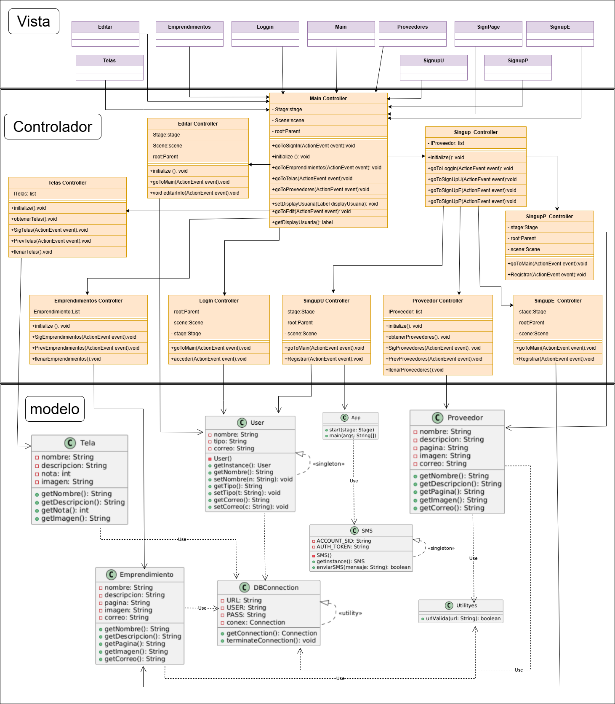

Diagrama MVC del Proyecto

## Descripción del Diagrama MVC

Este diagrama representa la arquitectura **MVC (Modelo-Vista-Controlador)** del sistema desarrollado. La estructura sigue el patrón de diseño MVC para separar responsabilidades y mejorar la mantenibilidad del código:

---

**Vista**

La capa de **Vista** contiene las diferentes pantallas (interfaces gráficas) del sistema. Estas vistas se encargan de mostrar la información al usuario y de enviar las acciones que éste realice a los controladores. Entre las vistas se encuentran:

- Editar
- Emprendimientos
- Login
- Main
- Proveedores
- SignupPage (con SignupU y SignupP)
- Telas

---

**Controlador**

La capa de **Controlador** maneja la lógica de navegación y la interacción entre la vista y el modelo. Cada controlador está asociado a una vista y a menudo también interactúa con el modelo. Por ejemplo:

- `MainController` conecta múltiples vistas y controla la transición entre ellas.
- `LoginController`, `SignupUController`, y `SignupPController` gestionan el acceso y el registro de usuarios.
- `EmprendimientosController`, `ProvedorController`, y `TelasController` manejan la carga de datos desde el modelo hacia las vistas correspondientes.

---

**Modelo**

La capa de **Modelo** gestiona los datos y la lógica de negocio. Incluye clases como:

- `User`: Representa un usuario del sistema.
- `Proveedor`, `Emprendimiento`, `Tela`: Representan las entidades principales que se gestionan.
- `DBConnection`: Gestiona la conexión a la base de datos (clase utility).
- `SMS`: Clase singleton para el envío de mensajes SMS.
- `Utilityes`: Contiene funciones auxiliares como validación de URLs.

---

Relaciones importantes

- Los controladores hacen uso del modelo para recuperar y modificar datos.
- `App` inicia la aplicación y carga la primera vista.
- `SMS`, `User` y `DBConnection` están implementadas como **Singleton** o **Utility** para garantizar una única instancia o reutilización de funciones.
- La vista y el modelo nunca se comunican directamente, toda interacción ocurre a través del controlador.

---

Este patrón facilita la separación de responsabilidades, mejora la organización del código y permite una mayor escalabilidad y testeo independiente de cada componente.
